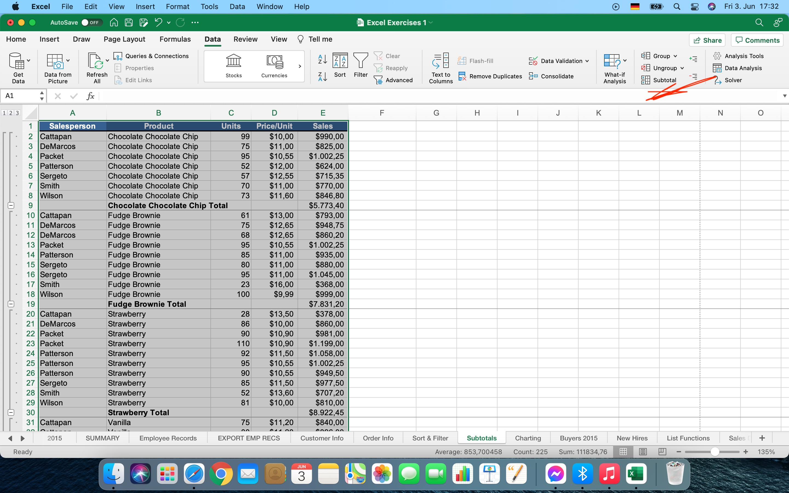

## Excel-basic-to-advanced-with-VBA

I'm a big fan of MS Excel and love to play with data by using it.
  
### How to enter and edit your Text and Formulas by making a basic table

 In this section I have discussed about very basic terms by making a table that is based on practical life.

  
  
There are two references which are  <b>relative cell reference </b> and <b> absolute cell reference </b> that I have cleared by calculating percentages. What are the difference between euro and dollar, how can you add your currency, how can increase or discrease digites (cents) after main amount and how to calculate the total amount are shown during the whole section. You can go through my youtube channel and watch the video: https://www.youtube.com/watch?v=fLGENkmWqNM&t=2s 
  
### Basic Excel Functions

<i> Excel Function: </i> There are lots of predefined functions such as sum function, count function etc. in excel that has been built by Microsoft company. We should use these functions for saving our valuable time. An excel function has three parts-

```diff
= FUNCTION NAME(ARGUMENTS)
For an example,
=SUM(B3:B9)
```
You can go through my youtube channel and watch the video on basic excel functions: https://www.youtube.com/watch?v=WD0uNgqDonk&list=PL3A70PxOg00ndqHcVaYrD2Lsue6APmoHw&index=2

### Modifying an Excel Worksheet

In this section I have discussed about the following sub-sections. To understand properly you can visit my youtube channel and watch the video https://www.youtube.com/watch?v=zewh8loJXOw

1. How to move and copy data in an excel worksheet-
  
  ```diff
  For copying we can as a shortcut key control+c (for windows) or command+c (for macbook)
  For moving just we have to use x instead of c
  For paste just we have to use v instead of c
  ```
  
2. How to inserting rows and columns, change width and height of cells, hide and unhide excel rows and columns, rename and delete excel worksheets and finally move and copy excel worksheets-
 
### Formating data in an excel worksheets
  
During this section I have talked about background of a cell, excel's format painter, marge and center of cells and finally conditional format. These basic terms are discussed in this video. Hope to enjoy and watch my video: 
  
### Inserting and formating images and shapes in excel worksheets

I am going to talk about images and shapes that you want to show your excel worksheets. How you do it properly? During the video I have discussed the matters. 

### Creating basic charts in Ms Excel

Here I am talking about column and pie charts. I have added and modified data by using several options under chart design and format and also showed how we can move a chart to another worksheet. 

### Printing an Excel worksheet

In this section I have talked about print preview, margin, scaling, page layout view, header & footer and finally specific print area. This section is really easy. Just watch it and try it out. 

### Let's talk about Excel Template 

Understanding Excel templete is really important. If you make a table by doing lots of calculation, you can save it as a template. You can use it again without doing calculation, just entry your data. That's it. Besides there are lots of ready microsoft online templete, you can download these and use anyone without making any function or doing any calculation. To get an idea just watch it and try it out

### Working with an excel list
I am using <i>Excel Exercises 1.xlsx</i> file. Here there are several worksheets. Let's go to start-

 1. <b>Understanding excel list sturcture:</b> For well planned list structure you have to make sure there is no empty column or row in your worksheet.
 2. <b>Sorting a list using single level sort:</b> To do this just go to underData. Then you will get an option which is sort. Then just click it whatever you want as ascending or descending.
    
 3. <b>Sorting a list deals with multi- level sort:</b> Really great opportunity for us, by this option we can sort multi levels at the same time. Here I use level 1 as Last Name as ascending order then I sort level 2 as First Name also as ascending order. Here important thing is at first level 1 is sorted then level 2. If level 1 has the same multiple time, in that time level 2 is sorted first as ascending order. Since same name work as a group in a level.   
    
 4. <b>Using customs sorts in an excel list:</b> As a defult when you will not get your desire option under Data tab in Sort. Then you have to think about custom in Sort. Where you will find it? Don't need to go any where, just look here and find an Custom option under Order. 
    
 5. <b> Filter an excel list using an Autofilter tool:</b> Autofilter tool is really great and super easy. Under Data tab you will get an option which is Filter. Just click here and several filted options are showed in header. Whatever you want to filter just do it.
 6. <b> Creating sub-totals in a list:</b> Go to sub-total worksheet. Under Data tab there is a sub-total option. Just click here and do it. Try it out.    
     
 7. <b> Formate a list as a Table:</b> You will face some problem if you don't formate. So to do it, just go to under Home tab; then you find a option which is Formate as Table. Just click it. Try it out. 
 8. <b> Using conditional formating to find duplicates:</b> Sometimes you need to identify the duplicate values in your worsheets. To do this just follow my instruction that is shown in the figure.  Home > Conditional Formating > Highlights cells Rules > Find duplicate tools. 
 9. <b> Removing Duplicates:</b> If you want to remove the duplicate id from you worksheet, then you might think about Remove Duplicate tools. To do this just go to under Data tab or Table tab. Then do it yourself. Try it out.
